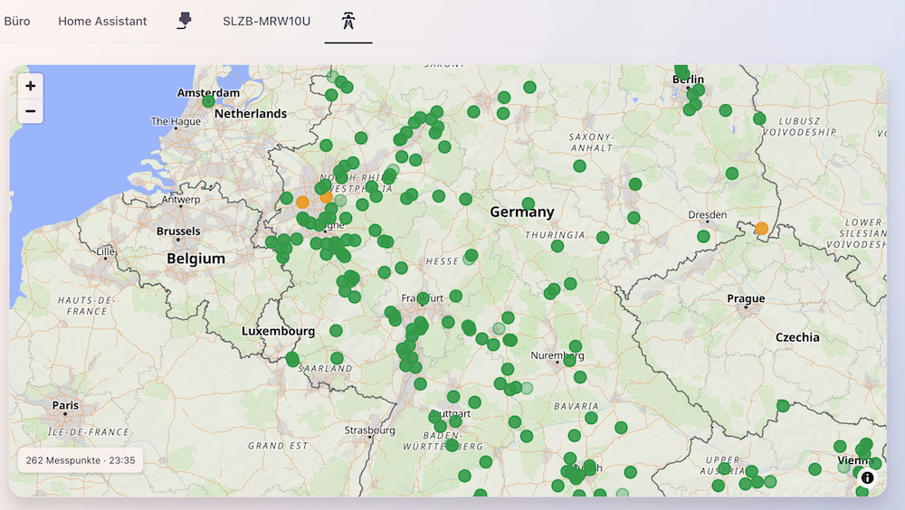
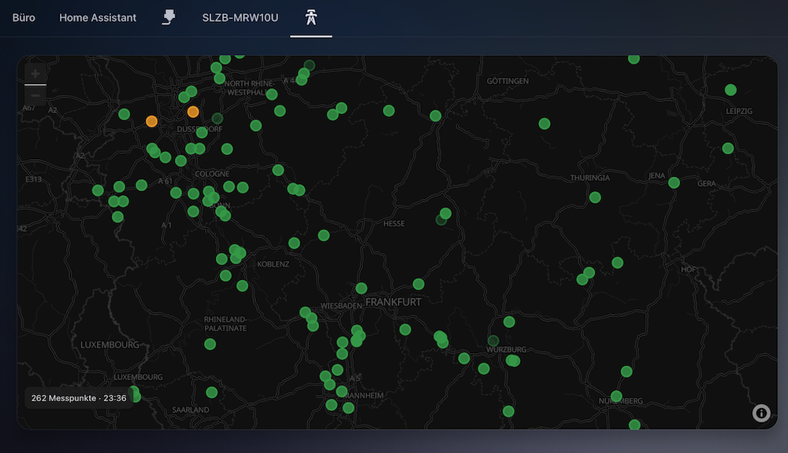

# Ortsnetz Map Card

**Version 1.0.1**

HACS-Dashboard-Card zur Darstellung der öffentlichen Messpunkte von [ortsnetz-auslastung.de](https://www.ortsnetz-auslastung.de/) in Home Assistant.

Die Card ist bewusst vom Backend getrennt. HACS verwaltet dieses Repository als **Dashboard-Plugin**; die Messdaten kommen über die separate Home-Assistant-Integration **Ortsnetz Map Backend**.

## Screenshots

| Light Mode | Dark Mode |
|---|---|
|  |  |


## Funktionen

- Kartenmittelpunkt standardmäßig am in Home Assistant hinterlegten Standort
- Standard-Zoom 10
- Grafischer Karteneditor in Home Assistant
- Phase für Markerfarbe: automatisch, L1, L2 oder L3
- Einstellbares Aktualisierungsintervall
- Optionale Statusanzeige
- Optional eigener Kartenmittelpunkt
- Breite und Höhe ausschließlich über Home Assistants **Layout**-Funktion
- Sections-Layout mit **Full Width**-Option
- Automatischer Dark Mode nach dem aktiven Home-Assistant-Theme
- OpenFreeMap / OpenStreetMap-Grundkarte ohne API-Key
- Farbskala und Grenzwerte aus der Ortsnetz-API
- Popups mit L1/L2/L3, Frequenz, Anzahl Messungen und Zeitstempel
- Veraltete Messwerte werden transparenter dargestellt

## Voraussetzung

Installiere zuerst oder zusätzlich das Repository **Ortsnetz Map Backend** (`home-assistant-ortsnetz-map`) als HACS-Integration und richte es unter **Einstellungen → Geräte & Dienste** ein.

## Installation über HACS

Automatisch


Manuel

1. In HACS **Benutzerdefinierte Repositories** öffnen.
2. Repository-URL hinzufügen und Typ **Dashboard** auswählen.
3. **Ortsnetz Map Card** installieren.
4. Home-Assistant-App bzw. Browser vollständig neu laden.

## Card hinzufügen

Die Card erscheint als **Ortsnetz Map** im Karten-Picker.

Minimal-Konfiguration:

```yaml
type: custom:ortsnetz-map-card
```

## Grafische Konfiguration

Im Karteneditor lassen sich einstellen:

- Zoom
- Markerphase: automatisch / L1 / L2 / L3
- Aktualisierungsintervall
- Statusanzeige
- Home-Assistant-Standort oder eigener Kartenmittelpunkt

**Breite und Höhe werden nicht in der Card konfiguriert.** Sie werden ausschließlich über Home Assistants Tab **Layout** eingestellt.

## Sections / Full Width

Die Card implementiert `getGridOptions()` ohne maximale Spaltenbegrenzung. Dadurch kann Home Assistant neben Rasterbreiten auch die native Option **Full** anbieten. Die Card füllt den zugewiesenen Bereich vollständig aus.

## Dark Mode

Die Card folgt automatisch dem aktiven Home-Assistant-Theme. Primär wird `hass.themes.darkMode` verwendet. Bei einem Theme-Wechsel werden Grundkarte, Bedienelemente, Attribution und Popups entsprechend aktualisiert.

## Daten

Die Card greift nicht direkt auf die externe Messdaten-API zu. Sie verwendet den authentifizierten WebSocket-Endpunkt der Backend-Integration:

```text
ortsnetz_map/get_points
```

## Externe Bibliothek / Karte

- Leaflet 1.9.4
- OpenFreeMap / OpenStreetMap Standard Tiles

Für die OpenFreeMap / OpenStreetMap-Grundkarte wird kein API-Key benötigt. Die erforderliche Attribution bleibt sichtbar.

## Hinweise

Dieses Projekt ist ein unabhängiges Community-Projekt und nicht Teil von `ortsnetz-auslastung.de`, OpenFreeMap / OpenStreetMap oder Home Assistant.

## Lizenz

Creative Commons Attribution-NonCommercial 4.0 International (**CC BY-NC 4.0**). Änderungen und nicht-kommerzielle Weitergabe sind unter Namensnennung erlaubt; kommerzielle Nutzung ist nicht gestattet. Details stehen in `LICENSE`.
